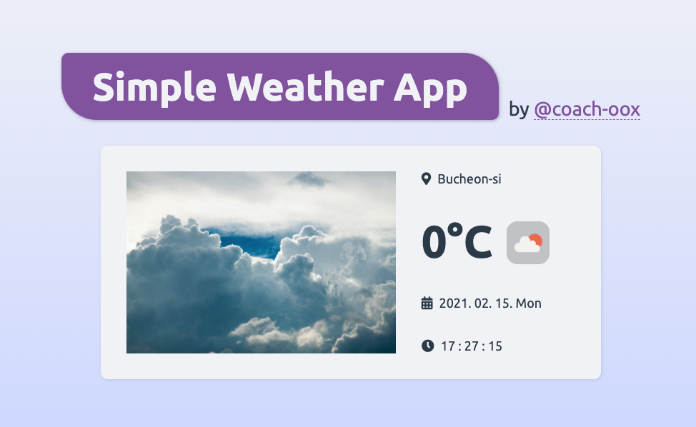

# Weather App

Simple Weather App with Vanilla Javascript. [[Demo]](https://coach-oox.github.io/weather-app/)  
🎈 Vanilla JS Project for Beginners.

⚠️ YOU NEED TO REPLACE `API_KEY` in `src/js/weather.js` WITH YOUR `API_KEY` (Generate API Key : [OpenWeatherMap](https://openweathermap.org/))

⚠️ `src/js/weather.js` 파일의 `API_KEY`를 [OpenWeatherMap](https://openweathermap.org/)에서 발급 받아 교체한 뒤 사용하세요.

## Preview

## Features

-   Date
-   Location
-   Real Time Clock
-   Current Weather
-   Weather Icon
-   Weather Theme (Image)

## Copyrights & Reference

-   Font : [Ubuntu](https://fonts.google.com/specimen/Ubuntu?preview.text_type=custom)
-   Icons : [Font Awesome](https://fontawesome.com/)
-   Weather API : [OpenWeatherMap](https://openweathermap.org/)
-   Images
    -   https://unsplash.com/photos/pGQbWXBC1dA
    -   https://unsplash.com/photos/R5SrmZPoO40
    -   https://unsplash.com/photos/zEjsmQJJGhY
    -   https://unsplash.com/photos/zrj-TPjcRLA
    -   https://unsplash.com/photos/Eddog6KkeK8
    -   https://unsplash.com/photos/n-vxsHr9jZA
